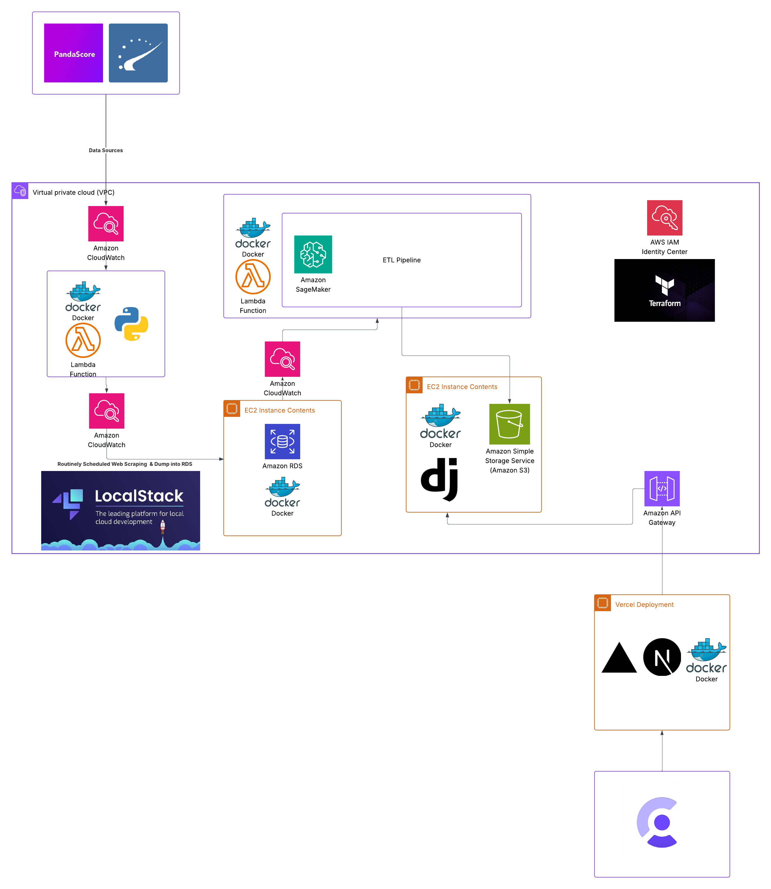

# Architecture Overview

CS2 is a rich E-Sport in which two teams of 5 face each other in an MR12 format, one team playing defensively as the Counter-Terrorists (CT’s), as the opposing team plays as Terrorist’s (T) attempt to plant a bomb on one of two bomb sites spread across each other on a chosen map. The T’s can win by either killing every player on the opposing team, or successfully planting the bomb, and defending it for 45 seconds before it explodes, while the CT’s can win by killing all the T’s and preventing them from planting the bomb, running down the round clock, or successfully defusing the bomb after it has been planted.

The game is highly competitive, and thus it has evolved as a sport with multiple markets, a skin-market for trading in-game weapon customization, and betting markets where users can place bets on the outcome of competitive matches. The purpose of this project is to design a reliable, robust CS2 Match predictor, which both displays the most up-to-date upcoming matches in the Pro CS2 Scene, alongside giving ML-powered match predictions available to the user.

The goal of this project is to design and build a FullStack Application on top of an end-to-end Machine Learning Pipeline that keeps an up to date ML-based match prediction model for CS2 Matches, which can be expanded in the future to develop trading and betting bots, alongside setting up the infrastructure to build market trading bots in other ESports markets, such as CS2's weapons skin market.

## 1. Project Structure

This repository is a meta-repository containing scripts and commands for deploying, previsioning, pushing, and orchestating the various microservices the application relies on inorder to function. Each of the individual microservices is cloned in the services folder, and when deployment occurs, each of these microservices are individually deployed (either locally using **LocalStack** or in production on **AWS**)**.** Additionally, this file contains general documentation for the project, alongside instructions on how to obtain more detailed documentation (located in each of the individual microservices). Below is the file/folder structure, with brief descriptions of each folder, not all files and folders are included in the diagram, only the most relevant front-facing folders are given descriptions and displayed.

📂 cs2-infrastructure

├── 📄 Makefile				# Collection of convenient commands for cloning, deploying, testing, etc.

├── 📄 README.md			# Introduction to the project, instructions, etc.

├── 📄 docker-compose.yml	# Docker Compose file for local development - orchestrates all services and LocalStack in one command.

└── 📂 docs/				# Docs explaining the design, implementation, features, and future plans for the application and it's development.

│  ├── 📄 ARCHITECTURE.md

│  ├── 📄 CONTRIBUTING.md

│  ├── 📄 DATABASE.md

│  ├── 📄 DEPLOYMENT.md

│  └── 📂 assets/				# assets for each of the docs.

└── 📂 e2e/					# Folder containing End-to-End tests for the entire application.

└── 📂 scripts/				# Scripts for building and cloning microservices, deployment, and pushing docker images.

│  ├── 📄 README.md

│  ├── 📄 build-services.sh

│  ├── 📄 clone-services.sh

│  ├── 📄 deploy-local.sh

│  ├── 📄 deploy-production.sh

│  ├── 📄 deploy-service.sh

│  ├── 📄 push-images.sh

└── 📂 services/				# A folder which contains the output of the clone-services script, containing each individual microservice.

└── 📂 terraform/

│  └── 📂 local/				# Terraform files for local deployment (using **LocalStack**)

│  └── 📂 production/			# Terraform files for production deployment to AWS

## 2. High-Level System Diagram

Below we can see a high level system diagram of the application, the system consists of multiple services, including the **cs2-webscraper-service, cs2-ml-pipeline-service, cs2-backend-service, and cs2-frontend-service** all of which are highlighted in the diagram below. Each of these services has it's own dedicated repository, and each individual service can be deployed independently, making heavy use of the **Dependency Injection (DI)** design pattern, to ensure the ease of testing and local deployment for development. We utilize a mix of both **LocalStack** for local development and mocking AWS services, alongside **AWS** for production development. We make heavy use of **Docker** and **Terraform** in order to provision the infrastructure needed for the application to work.

The general flow of the application is the following, we utilize **Amazon CloudWatch** (either locally or with **LocalStack**) in order to schedule webscraping jobs from our **cs2-webscraper-service**, which takes information data from both the **Pandascore Esports API**, and direct webscraping from **HLTV**, we utilize the **Dependency Injection (DI)** design pattern in order to determine which Database to dump the resulting data to (some relational database either Amazon RDS or a local PostgresSQL DB). This database is coupled with the **cs2-webscraper-service**, which keeps data such as **teams, players, matches, results, predictions, maps, etc**, all stored in a normalized format for future extraction.

Once populated, the **cs2-ml-pipeline-service** implements an ETL pipeline in Amazon Sagemaker, which extracts the information from the **Amazon RDS DB**, performs feature engineering through a sequence of joins on the normalized tables in order to obtain a current dataset. This dataset then undergoes a test-train-validation split, and a training job is run routinely (which is scheduled using CloudWatch and AWS Lambda Functions). If the resulting model passes data quality checks we then dump the model files into an **Amazon S3 Bucket**, which is used by the **cs2-backend-service** in ordder to serve the models for prediction by users.

The **cs2-backend-service** run as simple Django Backend on **EC2**, we also utilize Docker to containerize the application for ease of local testing and deployment. The application services the following endpoints **GET /models/[model_type]/prediction**, where we are expecting to deploy two simple models **XG_Boost**, and **Linear Regression**, although we reserve the right to deploy multiple models if we see fit during development. This **cs2-backend-service** is accessed by an **Amazon API Gateway** which exposes the backend server as the source of entry for the frontend application.

Finally, the **cs2-frontend-service** is a NextJS Frontend Application which allows users to sign-up, log in, and create their own predictions, while also viewing the ML powered predictions powered by the model. Additionally, this services utilizes Clerk for easy authentication, OAuth, etc.

Overall, the application is highly coupled, utilizing **AWS** and local stack to orchestrate complex interactions between each of the microservices. The design ensures an always available model ready for inference, which we hope to expand in the future to power trading and betting bots.

## 3. Core Components

(List and briefly describe the main components of the system. For each, include its primary responsibility and key technologies used.)

1. **cs2-webscraper-service:** A python based webscraper with rate-limiting which scrapes from **HLTV** and the **PandaScore API** in order to dump data into a relational PostgresSQL database, using **Dependency Injection** to ensure a modular design.
2. **cs2-ml-pipeline-service:** An **Amazon Sagemake**r based **ETL pipeline** which takes match data from the relational database managed by the **cs2-webscraper-service** which extracts, transforms, performs feature engineering, trains, and deploys the relevant ML models (making sure the ML models pass accuracy constraints). The pipeline then dumps the model files into an S3 Bucket for model inference.
3. **cs2-backend-service:** A **Django** server (which is deployed as serverless using EC2) which serves the model, alongside allowing access to matches, predictions, users, teams, etc.
4. **cs2-frontend-service:** A **NextJS** Application utilizing Clerk as a service to allow users to sign-up, log-in, create and view predictions, including ML powered predictions.

### 3.1. Frontend

Name: **cs2-frontend-service**

Description: A **NextJS** Application utilizing Clerk as a service to allow users to sign-up, log-in, create and view predictions, including ML powered predictions.

Technologies: **NextJS, React, TailwindCSS, ShadcnUI, Clerk**

Deployment: **Vercel**

### 3.2. Backend Services

#### 3.2.1. cs2-webscraper-service

Name: **cs2-webscraper-service**

Description: A rate-limited Python based webscraper which scrapes HLTV and the Pandascore API in order to populate a relational PostgresSQL Database.

Technologies: **Python, BeautifulSoup, PostgresSQL, psycopg2, Alembic, PyTest, Poetry, Pandascore API**

Deployment: **AWS Lambda Functions, AWS CloudWatch, Docker, LocalStack**

#### 3.2.2. cs2-ml-pipeline-service

Name: **cs2-ml-pipeline-service**

Description: An **Amazon Sagemake**r based **ETL pipeline** which takes match data from the relational database managed by the **cs2-webscraper-service** which extracts, transforms, performs feature engineering, trains, and deploys the relevant ML models (making sure the ML models pass accuracy constraints). The pipeline then dumps the model files into an S3 Bucket for model inference.

Technologies: **Amazon Sagemaker, ScikitLearn, TensorFlow, Pandas, Numpy, Python**

Deployment: **Amazon Sagemaker, AWS Lambda Functions, Amazon CloudWatch, LocalStack**

#### 3.2.3. cs2-backend-service

Name: **cs2-backend-service**

Description: A **Django** server (which is deployed as serverless using EC2) which serves the model, alongside allowing access to matches, predictions, users, teams, etc.

Technologies: **Python, Django, Amazon S3**

Deployment: **Amazon EC2, Docker, Amazon S3, LocalStack, Amazon API Gateway**

## 4. Data Stores

### 4.1. Amazon RDS DB

Name: **cs2-database**

Type: PostgresSQL

Purpose: Store the raw, normalized data which will be used as the basis for feature engineering and extraction by the **cs2-ml-pipeline-service**. Additionally stores data relevant for the user to obtain on the frontend.

Key Schemas/Collections: teams, matches, results, predictions, maps.

### 4.2. Amazon S3 Bucket

Name: **cs2-model-bucket**

Type: **Amazon S3 Bucket**

Purpose: stores the model files of the most up to date ml models for model inference.

## 5. External Integrations / APIs

Service Name 1: Clerk

Purpose: Handles user authentication, role-based authentication control, authorization, OAuth, JWTs etc.

Integration Method: NextJS SDK

## 6. Deployment & Infrastructure

Cloud Provider: AWS

Key Services Used: EC2, Lambda, CloudWatch, SageMaker,  IAM Identity Center, S3, RDS, VPC, API Gateway

CI/CD Pipeline: Github Actions, Vercel Deployment

Monitoring & Logging: Prometheus + Grafana

## 7. Security Considerations

The most important concern is to make sure that users cannot obtain access to the database directly, as the data cannot be accessible to the public since it is webscraped, it should only be used to power the model.

Authentication: OAuth2, JWTs

Authorization: RBAC

## 8. Development & Testing Environment

Local Setup Instructions: [CONTRIBUTING.md](./CONTRIBUTING.md)

Testing Frameworks: Jest, PyTest, Cypress

Code Quality Tools: ESLint, Prettier, Ruff

## 9. Future Considerations / Roadmap

(Briefly note any known architectural debts, planned major changes, or significant future features that might impact the architecture.)

* Architectural Debts
  * Using Clerk as a service makes it difficult to test locally, as the service is third-party and cannot be hosted locally, thus we don't get truly "local" development, attempting to mock Clerk or use some other AWS service for authentication that has a LocalStack equivalent could work. Additionally, thinking of how we can abstract authentication to a seperate service to allow for Dependency Injection maybe a useful approach.
* Major Planned Changes
  * Adding a players table, migrating the associated schema to enable more robust and rich feature engineering in the ETL pipeline.

## 10. Project Identification

Project Name: **cs2-infrastructure**

Repository URL: [cs2-infrastructure](https://github.com/MarwanBit/cs2-infrastructure)

Primary Contact/Team: Marwan Bit (marwanbit12@gmail.com)

Date of Last Update: **2025-11-12**
